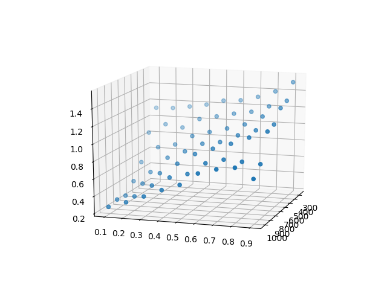

Here very basic RNNs are explored with the help of PyTorch.

If you want to dive into details of RNNs, then check these links:
- http://www.wildml.com/2015/09/recurrent-neural-networks-tutorial-part-1-introduction-to-rnns/
- https://colah.github.io/posts/2015-08-Understanding-LSTMs/

PyTorch version used: 1.2.0

All networks in this repo are analysed from text generation point of view.

These networks use character based generation approach.

As training dataset some Nietzsche texts are taken. You can download the dataset from [here](https://s3.amazonaws.com/text-datasets/nietzsche.txt).

## rnn1
Simplest basic RNN.

Given input of n characters the network is trying to predict n-th+1 character.
Inputs for this network are overlapping, so 1st input is a set of characters, say, 0-10,
second input is a set 1-11 and so on. This brings a lot of redundancy into learning,
because the network is trying to predict next single character.

The result is not as the one would expect, the words are correct, but they are repeating.
```
SUPPOSING that Truth i => PREFACE   SUPPOSING that Truth in the subject of the subject of the subject of
the subject of the subject of the subject of the subject of the subject o
```
This is caused by the nature of RNN itself due to possibility of gradient explosion and absence of regularization.

## rnn1_2

This network addresses one of the drawbacks of previous one, namely the not keeping
hidden state between invocations. Naturally we want hidden state to be preserved and
passed on to the network in subsequent invocations so that network tries to
learn the context.

> When saving hidden state between invocations don't forget to detach the values from computation

However due to the same gradient issues the network still generates repeated sequence of words:
```
SUPPOSING that Truth i => PREFACE   SUPPOSING that Truth is to say be a sort of the same sin of the same
sin of the same sin of the same sin of the same sin of the same sin of th
```

## rnn2

This network addresses 2 issues: learning redundancy and regularization.

Learning redundancy: take non overlapping sequences for input, like 0-10, 11-20 and so on.
Regularization: use LSTM network with dropout.

Surprisingly such approach immediately gives more appropriate result:
```
SUPPOSING that Truth is a woman- => PREFACE   SUPPOSING that Truth is a woman--which, as inheritenession
and the aspect of the state of soul as it is the same with the scientific spirit began to a desire for
the masses when the present contemplation of the spirit has been sacrificed in the world is the process
is a religious and the light of the world which has always been the contemplation of the soul-honor of
reason and the ascetic may be readily destiny and with regard to his hammer sense is the most potent loner
times a selfich makes us to do and is really the same time or a contemplation of others in such ach philfore
another is a religious conditional to the sting of religion and science has always been for the moment of heart
and his self preservation is also a false consequence of action is the consolited superiority or their own
personality and the soul as the imperative impulses the time is passions and pregnation. The consequent of soul,
the same word its objects the present can be experienced and with the senses of deceivers one has got attained that
of a single actions and personal senses a sort of religious feelings of delight and from the interfest the spect of
an innate expedience in comparable as an allegoration of Christianity and it is not only to the strangest thing and
he will less the one in the man of the saint for the same direction than to a religion and self emancipation of the
world who always seems to him an absolute predisposition to the same as the only thing is assortant precises the
feeling of discouragement when
```
Despite certain grammatical issues the text finally looks like Nietzsche :)

## rnn2_dropout_analyses 

Since certain results were achieved with rnn2, I did analyses of three parameters of the network:
- LSTM layers amount (1..4)
- final hidden layer size (256..1024)
- dropout value (0.1..0.9)

> if LSTM has only one layer, then dropout is not used, as it is applied to all but last layer

General parameters:
- number of epochs = 60
- training sequence size = 42 characters
- batch size = 64 sequences

First layers losses are explored.
```
[0.7939222455024719, 0.8113330602645874, 0.8978474140167236, 0.9201573729515076]
```
It's clear that with the increasing number of layers the complexity of the network
goes up and thus loss goes up. Since using 1 layer doesn't make sense, for analyses
of other parameters 2 layers in LSTM are used.

Assumptions:
- hidden layer growth decreases the loss as it is capable of capturing more parameters
- dropout growth increases the loss as it requires more runs to generalize



As expected lowest loss is with hidden layer size of 1024 and dropout rate of 0.1.
Here is sample text:
```
PREFACE   SUPPOSING that Truth is a woman--why should it be the truth?"  17. With
regard to his good name.   120  =Seligist and thoron threelf to the pendult of the
intellect and the latter of morals, it is not even himself antel when it is possible,
therefore, that cust in every walling generally should be assigned to an action been
treated to give chor its conscience that the Platonic origin of those who belongs
to the reason that a philosopher now are subtle miller of the will
```

Just for comparison this is the text for hidden layer size 256 and dropout 0.9:
```
PREFACE   SUPPOSING that Truth is a woman-and and the same and the states of the same
and the same and the strongent and the same of the same and the soul of the stronge
and the soul and the strength of the same and the strong of the strong of the sacrifice
and the senses of the sentiment of the strong of the same and the same and conscience
of the same and the strength and the same and the strength and so the same and the same
of the same and to be a stand of the same the state of the same
```

So with less parameters to capture (final hidden layer size) and with more "noise" in the
input (high dropout rate) the output becomes more like garbage.
 
